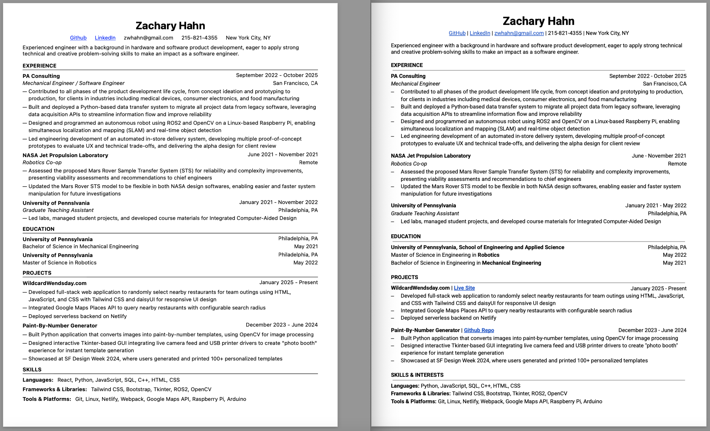

# React CV

[Live Demo](https://zwhahn-react-cv.netlify.app/)

## Overview

This is a web application built with React where users can input their information and generate a CV/ resume. The format is based off my own resume that I have been using for years. All pre-populated information is also my own to showcase what a filled in resume might look like. It is hosted on Netlify.

## Features

- Supports hyperlinks in the header
- automatically adds a new blank bullet when entering Experience or Project description for a smooth user experience
- Resume can be printed or downloaded from browser

## Preview

### React Resume (left) vs Google Sheets Resume (right)



## How to Run Locally

1. Clone the repository

```bash
git clone git@github.com:zwhahn/react-cv.git
cd react-cv
```

2. Install dependencies and start the development server

```bash
npm install
npm run dev
```

3. Open browser and navigate to: http://localhost:5173

## Tech Stack

- React
- Vite
- JavaScript
- CSS
- Netlify

## Future Development

- (!) Handle horizontal and vertical overflow
- Add local storage so reload does not override information
- Allow section title editing
- Add optional hyperlinks to projects
